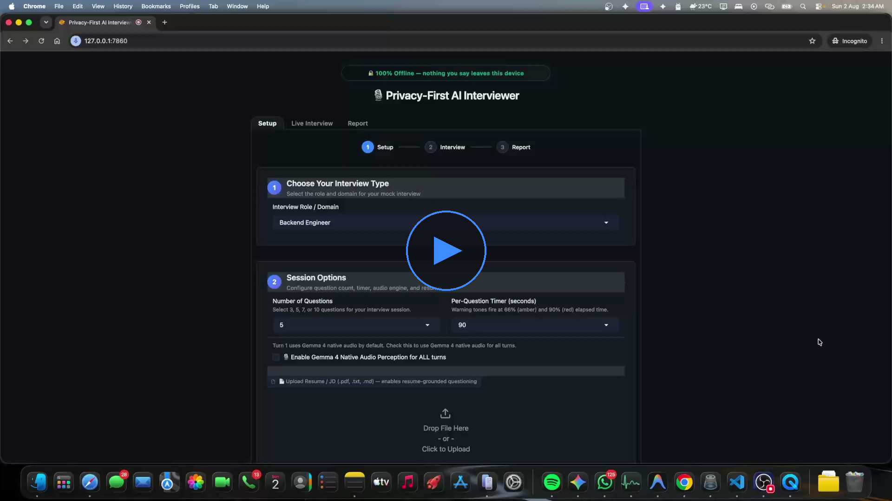

 # Privacy-First AI Interviewer 🎙️🔒

> A 100% offline, single-machine spoken mock-interview platform powered by **Gemma 4** (`gemma4:4b` / `gemma4:e4b` via Ollama).  
> Nothing you say, upload, or record ever leaves your local device.

[](https://www.python.org/)
[](LICENSE)
[](https://ollama.com/library/gemma4)
[](#-privacy-guarantee)
[](#-testing)

---

## 🎬 Demo Video

https://github.com/Ayushpate2003/ml-interviewer/raw/main/mlinterview.mp4

### 🌐 Portable Fallback for Kaggle Writeup & External Platforms

[](https://github.com/Ayushpate2003/ml-interviewer/raw/main/mlinterview.mp4)

> 💡 **Kaggle / External Writeup Note**: GitHub's inline video player does not embed on external sites like Kaggle. Use the clickable thumbnail snippet above, or replace `VIDEO_URL_HERE` with your unlisted YouTube/Drive link:  
> `[](VIDEO_URL_HERE)`

---

## 🌟 Overview & Key Capabilities

The **Privacy-First AI Interviewer** is designed for candidates, campus placement drives, and privacy-sensitive organizations needing realistic interview practice without data leakage, cloud API bills, or network latency.

### 🤖 Gemma 4 at the Core (3 Distinct Roles)
Gemma 4 isn't just a chatbot bolted on top — it drives three critical capabilities locally:
1. **Resume-Aware Reasoning**: Ingests uploaded PDF/text resumes and pasted Job Descriptions, auto-detects interview role/domain, and generates time-calibrated questions anchored directly in the candidate's real project experience and target JD requirements.
2. **Native Audio Perception**: Listens directly to candidate audio waves via Gemma 4 native perception (`stt/gemma_audio.py`), backed by `faster-whisper` fast fallback and live fluency signal analysis (`stt/confidence.py`).
3. **Structured 5-Dimension Rubric Evaluation**: Evaluates completed sessions across *Domain Knowledge*, *Problem Solving*, *Communication*, *Depth of Expertise*, and *Practical Trade-offs*, outputting strict, typed JSON for instant feedback.

---

## ✨ Features

- 🔒 **100% Offline Execution**: Zero external API calls during interview sessions.
- 📄 **Resume PDF Parsing & Role Auto-Detection**: Extracts resume text via multi-library fallback (`pypdf` → `PyPDF2` → `pdfplumber`), automatically classifies candidate domain, and flags mismatch suggestions with 1-click alignment.
- 📋 **Job Description (JD) Support**: Paste any JD text directly — the system auto-detects the target role, grounds interview questions in real JD requirements, and provides a JD-aligned ATS compatibility score. Safely handles long JD text without any OS errors.
- 📊 **Local ATS Resume Scoring**: Computes keyword match %, matched/missing keywords, and actionable recommendations locally/offline using `ats-resume-checker`.
- 📝 **Per-Question Detailed Feedback**: After each session, the Report tab shows an in-depth per-question evaluation with 5-dimension scores (Technical Depth, Communication Clarity, Confidence Fluency, STAR Completeness, Problem Solving), knowledge gaps, model answer examples, and actionable practice recommendations — all included in the PDF export.
- ⏱️ **Dynamic Per-Question Timer**: Live countdown timer that dynamically ticks down during recording, resets to the full duration on every new question, and plays warning tones at 66% (amber) and 90% (red) elapsed time.
- ⚙️ **Configurable Session Controls**: Choose 3, 5, 7, or 10 questions with per-question timers (60s/90s/120s).
- 🎨 **Polished Dark Theme UI**: Custom CSS design system (`theme.css`), 3-step progress bar (`Setup → Interview → Report`), Score Hero Ring, dark Plotly radar & bar charts, and collapsible full transcript.
- 📄 **Recruiter-Ready PDF Reports**: End-of-session ReportLab PDF report with overall scores, per-question detailed feedback, ATS match analysis, and complete transcript appendix.
- 🎬 **Hackathon Demo Script**: Includes a rubric-optimized 3-minute video script & production checklist ([demo_video_script.md](ai-interviewer/demo_video_script.md)).

---

## 🛠️ Tech Stack

| Layer | Technology | Role & Rationale |
|---|---|---|
| **Core Model** | **Gemma 4 E4B (`gemma4:e4b`)** | Reasoning, question generation, audio perception, per-question feedback & rubric scoring |
| **LLM Runtime** | **Ollama** | Local, low-latency execution server for Gemma 4 |
| **UI Framework** | **Gradio + Custom CSS** | Dark theme design system (`theme.css`) with 3-screen step workflow |
| **STT Fallback** | **faster-whisper (`small`)** | Local CPU-friendly speech-to-text fallback |
| **Fluency Engine** | Custom Heuristic (`stt/confidence.py`) | Filler word & hedging signal analyzer |
| **ATS Checker** | `ats-resume-checker` | Local/offline keyword extraction and match scoring |
| **PDF Extraction** | `pypdf`, `PyPDF2`, `pdfplumber` | Multi-library robust fallback resume & JD text extractor |
| **TTS Engine** | **Piper TTS** | Fast, local speech synthesis for spoken interviewer questions |
| **Storage & Memory**| **SQLite (`interview_sessions.db`)** | Zero-infra local session & turn persistence |
| **Report Generation**| **ReportLab + Plotly** | PDF export and interactive dark radar/bar scorecard charts |

---

## 🚀 Quick Start

### 1. Install & Serve Ollama with Gemma 4
```bash
# Install Ollama from https://ollama.ai
ollama pull gemma4:e4b
ollama serve   # Run in a separate terminal window
```

### 2. Environment Setup
```bash
cd ai-interviewer
python3 -m venv .venv
source .venv/bin/activate     # macOS / Linux
# .venv\Scripts\activate      # Windows
```

### 3. Install Dependencies
```bash
pip install -r requirements.txt
```

> **macOS Piper Note**: If `piper-tts` needs binary setup on macOS, download the binary from [rhasspy/piper releases](https://github.com/rhasspy/piper/releases) and place it on your `PATH`.

### 4. Launch Application
```bash
PYTHONPATH=. python app.py
```
Open **`http://127.0.0.1:7860`** in your browser.

---

## 🧪 Testing

Run the full deterministic test suite (requires no live network or Ollama calls):

```bash
PYTHONPATH=. pytest tests/ -v
```
All **125 unit & integration tests** pass deterministically across 12 test files.

---

## 📁 Project Structure

```
ai-interviewer/
├── app.py                      # Main Gradio application (Setup, Live Interview, Report)
├── theme.css                   # Dark theme design system (colors, cards, step indicators)
├── demo_video_script.md        # Rubric-optimized 3-minute hackathon demo video script
├── requirements.txt            # Python dependencies
├── llm/
│   ├── client.py               # Ollama Gemma 4 API wrapper, token budget & per-question feedback
│   ├── prompts.py              # Resume/JD-anchored system prompts, JSON schemas & per-question schema
│   └── parser.py               # Defensive JSON parsing & fallback scorecard
├── stt/
│   ├── gemma_audio.py          # Gemma 4 native audio perception engine
│   ├── transcribe.py           # faster-whisper local STT wrapper
│   ├── confidence.py           # Fluency signal analysis (filler/hedging detector)
│   └── vad.py                  # Voice Activity Detection (silence detection)
├── tts/
│   └── speak.py                # Piper TTS local voice synthesizer
├── utils/
│   ├── resume.py               # Resume/JD text extraction, role auto-detection (safe long-string handling)
│   └── ats.py                  # Local ATS resume compatibility analyzer (JD-aware scoring)
├── memory/
│   └── db.py                   # SQLite database persistence
├── report/
│   └── generate_report.py      # ReportLab PDF generator (incl. per-question feedback section)
└── tests/                      # 125 automated tests across 12 test files
    ├── test_app.py
    ├── test_e2e_flow.py
    ├── test_jd_integration.py
    ├── test_per_question_feedback.py
    ├── test_phase1_adaptive_difficulty.py
    ├── test_phase2_question_count.py
    ├── test_phase3_timer.py
    ├── test_phase5_no_resume.py
    ├── test_phase6_ats.py
    ├── test_report.py
    ├── test_unified_loading.py
    └── test_vad.py
```

---

## 🔒 Privacy Guarantee

- Audio streams are processed locally and discarded immediately after transcription.
- Transcripts, scores, and PDF reports stay inside your local workspace (`data/`).
- JD text and resume content never leave your machine.
- Zero telemetry, zero cloud calls, zero external API costs.
