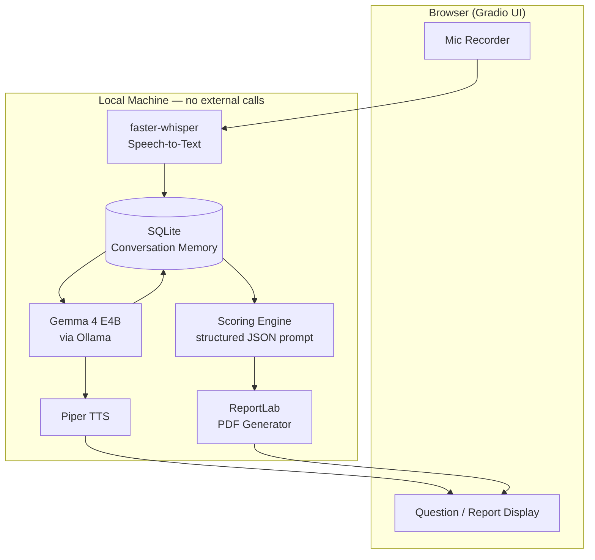
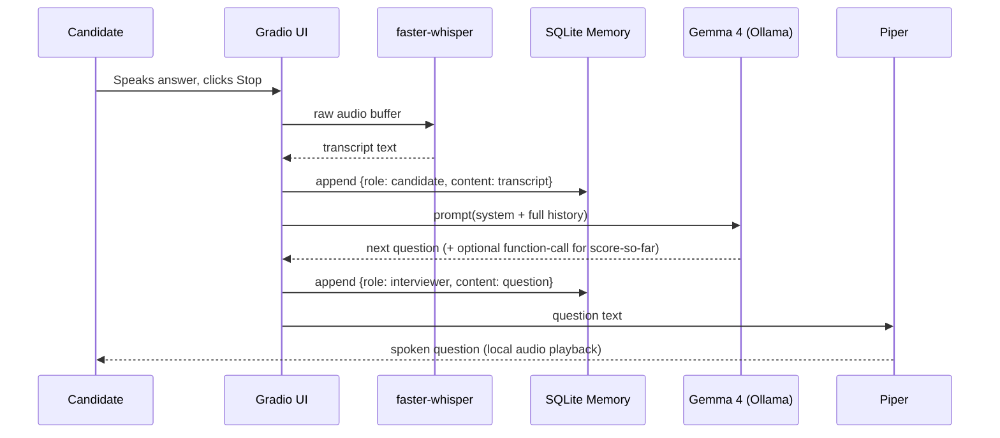

# Architecture — Privacy-First AI Interviewer

## 1. Executive Summary
A fully local pipeline: candidate speech → local STT → Gemma 4 (context + reasoning + scoring) → local TTS + report. No component in the critical path requires network access after initial model download. Gemma 4 is used for **both** the conversational reasoning (dynamic follow-ups) and the evaluation (structured scoring), which is what makes it the core of the system rather than a decoration.

## 2. Component Diagram


## 3. Sequence Diagram — One Interview Turn


## 4. Data Flow
1. Audio buffer (in-memory, never written to disk unpurged) → STT.
2. Transcript text → appended to SQLite `turns` table.
3. Full turn history → formatted into a single prompt → Gemma 4.
4. Gemma 4 response → parsed (plain text for questions, JSON for scores) → stored → rendered.
5. At session end, full `turns` table → one scoring prompt to Gemma 4 → JSON → ReportLab PDF.

## 5. Folder Structure
```
ai-interviewer/
├── app.py                  # Gradio entrypoint
├── stt/
│   └── transcribe.py       # faster-whisper wrapper
├── llm/
│   ├── client.py           # Ollama/Gemma 4 call wrapper
│   ├── prompts.py          # system prompts, rubric text, JSON schema
│   └── parser.py           # safe JSON extraction from model output
├── memory/
│   ├── db.py                # SQLite setup + CRUD
│   └── schema.sql
├── tts/
│   └── speak.py             # Piper wrapper
├── report/
│   └── generate_report.py   # ReportLab PDF builder
├── data/
│   └── interview_sessions.db
└── tests/                   # see unittest.md
```

## 6. Database Schema (SQLite)
```sql
CREATE TABLE sessions (
    session_id   TEXT PRIMARY KEY,
    role         TEXT,           -- e.g. "Backend Engineer"
    started_at   TEXT,
    ended_at     TEXT
);

CREATE TABLE turns (
    turn_id      INTEGER PRIMARY KEY AUTOINCREMENT,
    session_id   TEXT REFERENCES sessions(session_id),
    speaker      TEXT CHECK(speaker IN ('candidate','interviewer')),
    content      TEXT,
    timestamp    TEXT
);

CREATE TABLE scores (
    session_id      TEXT REFERENCES sessions(session_id),
    dimension       TEXT,   -- e.g. "technical_depth"
    score           INTEGER,
    justification   TEXT
);
```

## 7. API / Internal Function "Endpoints"
(Single-process app — these are internal function calls, not a network API, to keep everything offline.)
| Function | Input | Output |
|---|---|---|
| `transcribe(audio_bytes)` | raw mic buffer | text |
| `get_next_question(history, role)` | list of turns | question string |
| `score_session(history)` | full transcript | JSON scorecard |
| `speak(text)` | question string | audio playback |
| `generate_report(session_id)` | session_id | PDF file path |

## 8. Research Tables

### 8.1 UI Layer
| Tool | Offline Support | Ease of Integration | Recommendation |
|---|---|---|---|
| Gradio | Yes (local server) | Very high — built-in `Audio` component with mic input | **Recommended** for 1-day build |
| Streamlit | Yes | High, but needs `streamlit-webrtc` or similar for mic capture — more setup | Good alternative if team already knows Streamlit |
| NiceGUI | Yes | Medium — smaller community, less mic-input tooling out of the box | Not recommended for a 1-day sprint |
| React + FastAPI | Yes | Low — requires building the mic-capture and websocket plumbing yourself | Only if team has strong frontend skill and >1 day |
| Electron | Yes | Low — packaging overhead not worth it for a demo | Skip for hackathon |

### 8.2 Offline Speech-to-Text
| Tool | GPU | CPU | Streaming | Notes |
|---|---|---|---|---|
| faster-whisper | Optional | Yes, fast (CTranslate2 backend) | Yes (chunked) | **Recommended** — easiest pip install, good accuracy/speed balance |
| whisper.cpp | Optional | Yes | Yes | Great if you want a C++/embedded build; more setup friction in Python-first stack |
| WhisperX | Optional | Yes | Partial | Adds alignment/diarization — unneeded complexity for single-speaker MVP |
| Vosk | No (CPU only) | Yes, lightweight | Yes | Lower accuracy than Whisper variants; fine as a fallback on very low-RAM machines |
| Gemma 4 native audio (E2B/E4B/12B) | — | Runs wherever Gemma 4 runs | No (30s clip cap) | Genuinely novel: skips a separate STT model entirely and lets Gemma 4 transcribe *and* understand in one pass. Great stretch-goal differentiator, but the 30-second-per-clip limit makes it less robust than faster-whisper for longer answers. |

### 8.3 Local LLM Runtime
| Tool | Gemma 4 support | Install effort | Best for |
|---|---|---|---|
| **Ollama** | Yes — `ollama run gemma4` pulls quantized GGUF builds | One command | **Recommended**: fastest path to a working local Gemma 4 for a hackathon |
| llama.cpp | Yes, native GGUF + Multi-Token-Prediction (MTP) speedups | Moderate (build from source or prebuilt binary) | Teams wanting max control over quantization/perf |
| LM Studio | Yes, GUI-based | Low | Good for manual testing, less scriptable for an app |
| vLLM | Yes (dense/MoE variants) | High (best on GPU servers) | Overkill for a laptop demo |
| Jan AI | Yes | Low | Alternative GUI runtime, smaller community |

### 8.4 Gemma 4 Model Sizes
| Variant | Effective size | RAM (quantized) | Audio input | Best for |
|---|---|---|---|---|
| E2B | ~2.3B | ~2–3GB | Yes | Phones / very constrained laptops |
| **E4B** | ~4.5B | ~4–5GB | Yes | **Recommended** — best balance of reasoning quality and speed for a laptop demo |
| 12B (Unified) | 12B | ~8–16GB | Yes | If judges' machine has a strong GPU and you want higher-quality reasoning |
| 26B MoE | 3.8B active | Higher | No | Desktop/server only, no audio path |
| 31B Dense | 31B | Highest | No | Best raw reasoning, but too heavy for a live laptop demo |

Why Gemma 4 as the core engine: it's Apache-2.0 licensed (no commercial-use friction), ships edge-sized variants that fit consumer laptops, and — uniquely among open local models — the E2B/E4B/12B variants natively understand audio and support structured function calling, so the same model can plausibly do transcription, reasoning, and scoring without stitching together three different vendors' models.

### 8.5 Text-to-Speech
| Tool | Offline | Naturalness | Speed | Notes |
|---|---|---|---|---|
| **Piper** | Yes | Good | Very fast (real-time on CPU) | **Recommended** — simplest CLI, small models |
| Coqui TTS | Yes | Very good | Slower on CPU | Higher quality if GPU available |
| Kokoro TTS | Yes | Very good | Fast | Good alternative, smaller community/tooling maturity |
| OpenVoice | Yes | Good, voice-cloning focus | Moderate | Overkill — voice cloning isn't a requirement here |

### 8.6 Report Generation
| Tool | Output quality | Effort | Notes |
|---|---|---|---|
| **ReportLab** | High | Low-moderate | **Recommended** — generates PDF directly in Python, no browser dependency |
| WeasyPrint | High | Moderate | Great if you'd rather template in HTML/CSS, needs system libs installed |
| python-docx | Good | Low | Use if you want an editable Word report instead of PDF |
| Markdown → PDF (pandoc) | Medium | Low | Fastest to stand up but least visual control |

## 9. Development Roadmap
1. **Phase 1 — Setup**: install Ollama + pull Gemma 4 E4B, install faster-whisper/Gradio/Piper/ReportLab.
2. **Phase 2 — Audio pipeline**: mic capture → faster-whisper transcript, verified via console.
3. **Phase 3 — Gemma integration**: system prompt + history → next question, tested via CLI loop.
4. **Phase 4 — Memory**: SQLite persistence of turns/sessions.
5. **Phase 5 — Evaluation**: end-of-session structured JSON scoring prompt.
6. **Phase 6 — Report generation**: ReportLab PDF from scorecard + transcript.
7. **Phase 7 — Demo polish**: role picker, offline badge, error handling, rehearsal.

## 10. Final Tech Stack Table
| Category | Recommended | Alternative | Why Recommended |
|---|---|---|---|
| UI | Gradio | Streamlit | Built-in mic component, fastest to wire up |
| STT | faster-whisper (small) | Gemma 4 native audio | Robust, no clip-length limit, well-documented |
| LLM Runtime | Ollama | llama.cpp | One-command install, good enough perf for demo |
| Core Model | Gemma 4 E4B | Gemma 4 E2B | Best reasoning/speed tradeoff on a laptop |
| Memory | SQLite | In-memory list only | Persists across a crash/refresh, trivial schema |
| TTS | Piper | Coqui TTS | Fastest on CPU, good enough quality |
| Report | ReportLab | python-docx | Direct PDF, no extra system dependencies |

## 11. Hardware Requirements
- Minimum: 8GB RAM, modern quad-core CPU, working mic/speakers — runs E2B/E4B comfortably.
- Recommended: 16GB RAM or a consumer GPU (RTX 3060+) — enables the 12B Unified model for higher-quality reasoning and smoother TTS/STT concurrency.
- No internet required at interview time; only for the one-time model downloads.

## 12. Stretch Goals (post-MVP)
Resume-aware questioning (lightweight keyword match now, ChromaDB/FAISS RAG later) · coding-interview mode with a code editor panel · multi-language interviews (Gemma 4's 140+ languages) · function-calling-driven structured note-taking during the interview · recruiter dashboard across multiple candidates · vector search over past interview history · real-time coaching hints · emotion/eye-contact estimation via webcam (privacy tradeoffs to weigh carefully) · MCP integration for pulling a live job description from a connected ATS.

## 13. Similar Open-Source Projects (context, not dependencies)
| Project | Similarity | What Gemma 4 adds |
|---|---|---|
| whisper.cpp / faster-whisper | STT building block only, no interview logic | We add the reasoning + scoring layer on top |
| Various "AI mock interviewer" web apps (cloud-based) | Similar UX goal | Ours is fully offline and privacy-preserving — the differentiator |
| LangGraph-based conversational agents | Memory/orchestration patterns are relevant | Gemma 4's native function calling can replace a chunk of that orchestration code |
